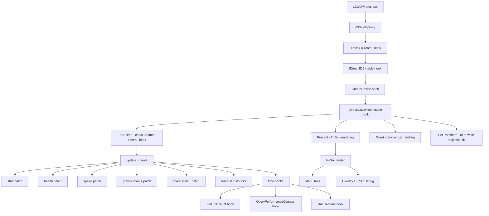

# Black Pearl Engine

> **WIP** — Mod menu / cheat engine for **LEGO Pirates of the Caribbean: The Video Game**

-blue)
-orange)


## Table of Contents

- [What Works](#what-works)
- [What's Broken / WIP](#whats-broken--wip)
- [Quick Start](#quick-start)
- [Controls](#controls)
- [Config](#config)
- [Known Addresses](#known-addresses)
- [Project Structure](#project-structure)
- [License](#license)

## What Works

| Cheat | Status | Notes |
|-------|--------|-------|
| **Infinite Studs** | ✅ | NOPs the `sub ebx,eax` + `sbb esi,edx` at fixed instruction addresses |
| **Custom Stud Value** | ✅ | Writes to display address every frame |
| **Golden Bricks** | ✅ | Forces golden brick count via module base + offset |
| **Y Velocity** | ✅ | Dynamically scans `.text` for `FMUL [reg+0xD78]` and redirects to a user-controlled gravity multiplier. Slider range: **-10 to +1000** (negative = low gravity / float, positive = super jump) |
| **Character Scale** | ✅ | Dynamically scans `.text` for `FLD [reg+0xFB0]` and redirects to a user-controlled scale float. Slider range: **10% to 1000%** |
| **Super Speed** | ✅ | Overwrites walk/run speed float constants in memory |
| **Speed Mult** | ✅ | Scales game time delta via `GetTickCount`/`QueryPerformanceCounter`/`timeGetTime` hooks. Range: **1x to 100x** |
| **Ultra-Wide Support** | ✅ | Hooks `SetTransform` to fix projection matrix for 21:9, 32:9, and custom aspect ratios |
| **Breathe Underwater** | ✅ | NOPs oxygen timer decrement (`DEC [ESI+0x336]`) — infinite breath underwater |
| **Menu UI** | ✅ | ImGui-based overlay with 5 tabs, keyboard navigation, text input for values |
| **FPS Counter** | ✅ | Real-time FPS display (toggle with in-menu option) |
| **Debug Info** | ✅ | Entity string table viewer (toggle with **F2**) |
| **Config File** | ✅ | Saves/loads all cheat toggles and values from `bpe.cfg` |

## What's Broken / WIP

| Cheat | Status | Issue |
|-------|--------|-------|
| **Invincibility** | ⚠️ | Health decrement scanner finds some offsets, but reliability varies by game version |
| **Time Freeze** | ⚠️ | Hooks `GetTickCount`/`QueryPerformanceCounter`/`timeGetTime` via MinHook; untested in all scenarios |
| **Input Blocking** | ⚠️ | WndProc + PeekMessageA hooks; unreliable under Wine/Proton |
| **NoClip** | ❌ | Placeholder — not yet implemented |
| **Stud Magnet** | ❌ | Placeholder — not yet implemented |
| **Extra Hearts / Regenerate** | ❌ | Placeholders in Health tab |

Most hardcoded addresses were found via Cheat Engine and are specific to the GOG/retail build. They will likely differ for Steam or other versions. Cheats that use dynamic `.text` section scanning (Y Velocity, Character Scale, Invincibility) are more resilient to game patches.

## Quick Start

1. Copy `d3d9.dll` next to `LEGOPirates.exe`
2. For Wine/Proton: `export WINEDLLOVERRIDES="d3d9=n,b"`
3. Launch the game
4. Press **F1** to open the menu

### Build from Source

**Linux (cross-compile):**
```bash
sudo apt install g++-mingw-w64-i686
make clean && make
make install   # copies to game directory
```

**Windows (MSYS2/MinGW):**
1. Install [MSYS2](https://www.msys2.org/) (or via winget: `winget install MSYS2.MSYS2`)
2. In MSYS2 MINGW32 shell, install the toolchain:
   ```bash
   pacman -S mingw-w64-i686-toolchain
   ```
3. Build:
   ```bash
   cd /path/to/black-pearl-engine
   mingw32-make clean && mingw32-make
   mingw32-make install   # copies to game directory
   ```
   Or use the `run` target to launch the game after install:
   ```bash
   mingw32-make run
   ```

## Controls

| Key | Action |
|-----|--------|
| **F1** | Toggle Menu (saves config on close) |
| **F2** | Toggle Debug Info |
| **↑ / ↓** | Navigate items |
| **← / →** | Switch tabs |
| **Enter** | Toggle cheat / Edit value |
| **Escape** | Cancel editing |
| **Backspace** | Delete char in input |
| **0-9 / Numpad** | Type numbers (when editing a value) |

### Menu Tabs

| Tab | Contents |
|-----|----------|
| **Health** | Invincibility, Extra Hearts, Regenerate, Breathe Underwater |
| **Studs** | Infinite Studs, Force Custom Value, Custom Studs, Force Golden Bricks, Golden Bricks, Stud Magnet, Score Multiplier |
| **Fun** | Super Speed, Y Velocity (+ Y Strength slider), Character Scale (+ Scale % slider), NoClip, Time Freeze, Speed Mult slider |
| **Visual** | FPS Counter, Debug Info |
| **UltraWide** | Enable Ultra-Wide, Ratio selection (Auto / 16:9 / 21:9 / 32:9) |

### Cheat Details

- **Y Velocity** — Toggle on/off. Use **Y Strength** slider to control vertical movement multiplier. Values: -10 (low gravity / float) to +1000 (extreme jump height). Default: 100 (10x normal gravity).
- **Character Scale** — Toggle on/off. Use **Scale %** slider to resize the character model. Range: 10% (tiny) to 1000% (giant). Default: 100 (normal size).
- **Speed Mult** — Value slider (1–100). Multiplies all game time deltas, effectively speeding up the entire game engine including animations, physics, and AI. Default: 1 (normal speed).

## Config

Settings auto-save on menu close (F1) and on game exit.  
Edit `bpe.cfg` to set default values:

```ini
# Black Pearl Engine config
# Generated automatically. Edit and restart to apply.

infinite_studs=1
invincible=0
super_speed=0
super_jump=0
super_jump_scale=100
speed_mult=1
time_freeze=0
noclip=0
show_debug=0
show_fps=0
score_mult=1
force_custom_studs=1
custom_stud_value=999999
force_golden_bricks=1
golden_brick_value=85
uw_enabled=0
uw_ratio=0
char_scale=0
char_scale_val=100
underwater_breath=0
```

### Config Keys

| Key | Type | Default | Description |
|-----|------|---------|-------------|
| `infinite_studs` | toggle | 0 | NOP the stud subtraction instruction |
| `invincible` | toggle | 0 | NOP health decrement instructions |
| `super_speed` | toggle | 0 | Override walk/run speed constants |
| `super_jump` | toggle | 0 | Enable Y Velocity gravity modifier |
| `super_jump_scale` | int | 100 | Gravity multiplier ×10 (e.g. 100 = 10.0×) |
| `speed_mult` | int | 1 | Game time multiplier (1–100×) |
| `time_freeze` | toggle | 0 | Freeze game time |
| `noclip` | toggle | 0 | Placeholder |
| `show_debug` | toggle | 0 | Show entity debug panel |
| `show_fps` | toggle | 0 | Show FPS counter |
| `score_mult` | int | 1 | Stud score multiplier (1–10) |
| `force_custom_studs` | toggle | 1 | Force stud display to custom value |
| `custom_stud_value` | int | 999999 | Custom stud count to display |
| `force_golden_bricks` | toggle | 1 | Force golden brick count |
| `golden_brick_value` | int | 85 | Golden brick count to force |
| `uw_enabled` | toggle | 0 | Enable ultra-wide projection fix |
| `uw_ratio` | int | 0 | Aspect ratio mode (0=Auto, 1=16:9, 2=21:9, 3=32:9) |
| `char_scale` | toggle | 0 | Enable character scale modifier |
| `char_scale_val` | int | 100 | Character scale percentage (10–1000) |
| `underwater_breath` | toggle | 0 | NOP oxygen timer decrement for infinite underwater breath |

## Known Addresses

Addresses are `_LEGOPirates.exe + offset` from module base.

### Hardcoded Addresses

These are still fixed and may break across game versions:

| Purpose | Address | Notes |
|---------|---------|-------|
| Stud subtract | `0x006B1BC5` (`sub ebx,eax`) + `0x006B1BC7` (`sbb esi,edx`) | NOP'd for infinite studs |
| Stud display | `0x0369B660` (4 bytes) | Forced each frame for custom value |
| Golden bricks | `base + 0x00B776E4` (4 bytes) | Forced each frame |
| Entity table | `base + 0x00C8F400` | Pointer array to entity strings |
| Walk speed | `0x00E24C50` (float) | Overwritten for Super Speed |
| Oxygen timer | `base + 0x0037B910` (`DEC [ESI+336]`) | NOP'd for Breathe Underwater |
| Run speed | `0x00E24C54` (float) | Overwritten for Super Speed |
| Aspect ratio | `base + 0x006740B0` (float) | Saved/restored for Ultra-Wide |

### Dynamically Scanned Addresses

These cheats scan the `.text` section at runtime for instruction patterns, making them resilient to game patches:

| Cheat | Pattern Scanned | Purpose |
|-------|----------------|---------|
| **Y Velocity** | `D8 8? 78 0D 00 00` (`FMUL [reg+0xD78]`) | Redirects gravity factor to user-controlled float |
| **Character Scale** | `D9 8? B0 0F 00 00` (`FLD [reg+0xFB0]`) | Redirects character scale load to user-controlled float |
| **Invincibility** | `DEC [reg+0x864]` pattern | NOPs health decrement instructions |

## Project Structure

```
src/
├── config.h             # Memory addresses, offsets, and constants
├── config_loader.c/h    # bpe.cfg save/load (key-value mapping)
├── cheats.c/h           # All cheat implementations (patching, scanning, updating)
├── menu.c/h             # ImGui-based overlay menu (5 tabs, keyboard nav)
├── hooks.c/h            # D3D9 vtable hooks (EndScene, Present, Reset), time hooks, WndProc subclass
├── input.c/h            # DirectInput8 hooks for keyboard/mouse capture
├── utils.c/h            # Logging, memory patching, .text section finder
├── uw.c/h               # Ultra-wide support (aspect ratio patching, SetTransform hook)
├── d3d9_proxy.c         # DllMain + Direct3DCreate9 proxy (entry point)
└── d3d9_proxy.def       # DLL exports

lib/
├── minhook/             # MinHook library (API hooking)
└── imgui/               # Dear ImGui (menu rendering)
```

## Architecture



## License

MIT
