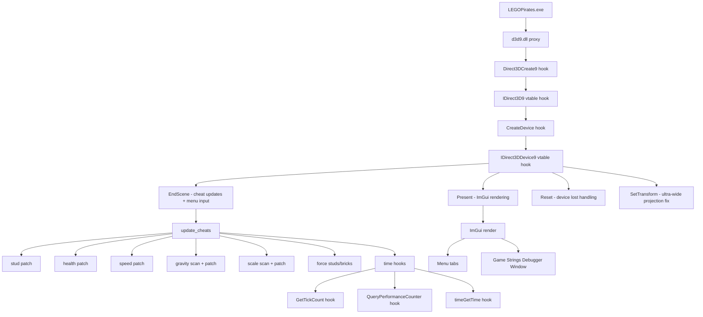

# Black Pearl Engine

> **WIP** — Premium mod menu / cheat engine for **LEGO Pirates of the Caribbean: The Video Game**

-blue)
-orange)


## Table of Contents

- [What Works](#what-works)
- [What's Broken / WIP](#whats-broken--wip)
- [Quick Start](#quick-start)
- [Controls](#controls)
- [Config](#config)
- [Signature Scanning & Addresses](#signature-scanning--addresses)
- [Project Structure](#project-structure)
- [License](#license)

## What Works

| Cheat | Status | Notes |
|-------|--------|-------|
| **Infinite Studs** | ✅ | **Dynamically scanned (AOB)** — NOPs `sub ebx,eax` + `sbb esi,edx` |
| **Invincibility** | ✅ | **Dynamically scanned (AOB)** — Disables enemy damage (`DEC [ebp+0xE26]`) and death health reset (`MOV [esi+0xE26],cl`) |
| **Breathe Underwater** | ✅ | **Dynamically scanned (AOB)** — NOPs oxygen timer decrement (`DEC [esi+0x336]`) |
| **Custom Stud Value** | ✅ | Forces custom display value every frame |
| **Golden Bricks** | ✅ | Forces golden brick count via base + offset |
| **Y Velocity** | ✅ | Dynamically scans `.text` for `FMUL [reg+0xD78]` and redirects to a user-controlled gravity multiplier. Slider range: **-10 to +1000** |
| **Character Scale** | ✅ | Dynamically scans `.text` for `FLD [reg+0xFB0]` and redirects to a user-controlled scale float. Slider range: **10% to 1000%** |
| **Super Speed** | ✅ | Overwrites walk/run speed float constants in memory |
| **Speed Mult** | ✅ | Scales game time delta via time hooks. Range: **1x to 100x** |
| **Ultra-Wide Support** | ✅ | Hooks `SetTransform` to fix projection matrix for 21:9, 32:9, and custom aspect ratios |
| **Menu UI** | ✅ | Custom ImGui-based overlay keyboard navigation and premium Dark Gold & Sea-Teal theme |
| **FPS Counter** | ✅ | Real-time FPS display toggle |
| **Debug Info** | ✅ | **Interactive Debugger** — Scrollable ImGui child window scanning entity string table with case-insensitive search and filter (toggle with **F2**) |
| **Config File** | ✅ | Saves/loads all cheat toggles and values from `bpe.cfg` |

## What's Broken / WIP

| Cheat | Status | Issue |
|-------|--------|-------|
| **Time Freeze** | ⚠️ | Hooks time APIs via MinHook; untested in all scenarios |
| **Input Blocking** | ✅ | Subclassed WndProc + DirectInput8 keyboard hooks; fully reliable on Windows and Wine |
| **NoClip** | ❌ | Placeholder — not yet implemented |
| **Stud Magnet** | ❌ | Placeholder — not yet implemented |
| **Extra Hearts / Regenerate** | ❌ | Placeholders in Health tab (redundant with Invincibility) |

Cheats that use dynamic `.text` section scanning (Y Velocity, Character Scale, Invincibility, Studs, and Oxygen) are highly resilient to game patches and will work across different game versions (Steam, GOG, retail).

## Quick Start

1. Copy `d3d9.dll` next to `LEGOPirates.exe`
2. For Wine/Proton: `export WINEDLLOVERRIDES="d3d9=n,b"`
3. Launch the game
4. Press **F1** to open the menu

### Build from Source

**Linux (cross-compile):**
```bash
sudo apt install g++-mingw-w64-i686
make clean && make
make install   # copies to game directory
```

**Windows (Standalone Toolchain / MSYS2):**
1. Download a standalone 32-bit compiler such as **[WinLibs i686-posix-dwarf](https://winlibs.com/)** and extract it to `C:\ProgramData\mingw32`.
2. Build:
   ```bash
   mingw32-make clean && mingw32-make
   mingw32-make install   # copies to game directory
   ```
   Or use the `run` target to launch the game after install:
   ```bash
   mingw32-make run
   ```

## Controls

| Key | Action |
|-----|--------|
| **F1** | Toggle Menu (saves config on close) |
| **F2** | Toggle Game Strings Debug Window |
| **↑ / ↓** | Navigate items |
| **← / →** | Switch tabs |
| **Enter** | Toggle cheat / Edit value |
| **Escape** | Cancel editing |
| **Backspace** | Delete char in input |
| **0-9 / Numpad** | Type numbers (when editing a value) |

### Menu Tabs

| Tab | Contents |
|-----|----------|
| **Health** | Invincibility, Extra Hearts, Regenerate, Breathe Underwater |
| **Studs** | Infinite Studs, Force Custom Value, Custom Studs, Force Golden Bricks, Golden Bricks, Stud Magnet, Score Multiplier |
| **Fun** | Super Speed, Y Velocity (+ Y Strength slider), Character Scale (+ Scale % slider), NoClip, Time Freeze, Speed Mult slider |
| **Visual** | FPS Counter, Debug Info |
| **UltraWide** | Enable Ultra-Wide, Ratio selection (Auto / 16:9 / 21:9 / 32:9) |

---

## Signature Scanning & Addresses

Most static addresses are relative to `_LEGOPirates.exe` base. Patches using AOB (Array of Bytes) patterns scan the game's executable `.text` segment on startup for stability across versions.

### Dynamically Scanned Patches (AOB)

| Cheat | Pattern Scanned | Purpose / Patch Action |
|-------|----------------|------------------------|
| **Y Velocity** | `D8 8? 78 0D 00 00` | Redirects gravity factor `FMUL [reg+0xD78]` to global float |
| **Character Scale** | `D9 8? B0 0F 00 00` | Redirects scale `FLD [reg+0xFB0]` to global float |
| **Infinite Studs** | `29 C3 19 D6` | Locates and NOPs `sub ebx,eax` + `sbb esi,edx` |
| **Enemy Damage** | `FE 8D 26 0E 00 00` | Locates and NOPs `DEC [ebp+0xE26]` |
| **Death Health Reset** | `88 8E 26 0E 00 00` | Locates and NOPs `MOV [esi+0xE26],cl` |
| **Breathe Underwater** | `FE 8E 36 03 00 00` | Locates and NOPs `DEC [esi+0x336]` |

### Hardcoded Offsets & Fallbacks

| Purpose | Address / Offset | Notes |
|---------|------------------|-------|
| Stud display | `0x0369B660` (4 bytes) | Forced each frame for custom value |
| Golden bricks | `base + 0x00B776E4` (4 bytes) | Forced each frame |
| Entity table | `base + 0x00C8F400` | Pointer array to entity strings |
| Walk speed | `0x00E24C50` (float) | Overwritten for Super Speed |
| Run speed | `0x00E24C54` (float) | Overwritten for Super Speed |
| Aspect ratio | `base + 0x006740B0` (float) | Saved/restored for Ultra-Wide |

---

## Project Structure

```
src/
├── config.h             # Memory addresses, offsets, and constants
├── config_loader.c/h    # bpe.cfg save/load (key-value mapping)
├── cheats.c/h           # All cheat implementations (patching, scanning, updating)
├── menu.c/h             # ImGui-based overlay menu and debugger window
├── hooks.c/h            # D3D9 vtable hooks, time hooks, WndProc subclass
├── input.c/h            # DirectInput8 hooks for keyboard capture
├── utils.c/h            # Logging, memory patching, AOB pattern scanner
├── uw.c/h               # Ultra-wide support (aspect ratio patching, SetTransform hook)
├── d3d9_proxy.c         # DllMain + Direct3DCreate9 proxy (entry point)
└── d3d9_proxy.def       # DLL exports

lib/
├── minhook/             # MinHook library (API hooking)
└── imgui/               # Dear ImGui (menu rendering)
```

## Architecture



## License

MIT
