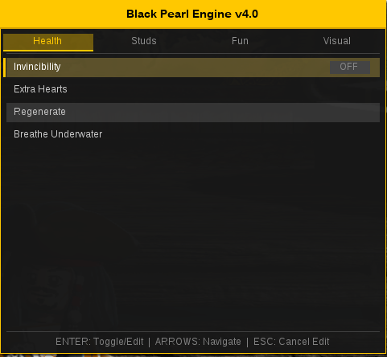

# Black Pearl Engine

> **v5.0** — Premium mod menu / cheat engine for **LEGO Pirates of the Caribbean: The Video Game**

-blue)
-orange)




## Table of Contents

- [Quick Start](#quick-start)
- [What Works](#what-works)
- [Menu Tabs](#menu-tabs)
- [Controls](#controls)
- [Presets System](#presets-system)
- [Favorites System](#favorites-system)
- [Hotkey Customization](#hotkey-customization)
- [Native Cheat System](#native-cheat-system)
- [Config V2](#config-v2)
- [Memory Browser](#memory-browser)
- [Signature Scanning & Addresses](#signature-scanning--addresses)
- [Project Structure](#project-structure)
- [Architecture](#architecture)
- [License](#license)

---

## Quick Start

1. Copy `d3d9.dll` next to `LEGOPirates.exe`
2. For Wine/Proton: `export WINEDLLOVERRIDES="d3d9=n,b"`
3. Launch the game
4. Press **F1** to open the menu

### Build from Source

**Linux (cross-compile):**
```bash
sudo apt install g++-mingw-w64-i686
make clean && make          # release build
make DEBUG=1                # debug build with symbols
make install                # copies to game directory
```

**Windows (Standalone Toolchain / MSYS2):**
1. Download a standalone 32-bit compiler such as **[WinLibs i686-posix-dwarf](https://winlibs.com/)** and extract it to `C:\ProgramData\mingw32`.
2. Build:
   ```bash
   mingw32-make clean && mingw32-make
   mingw32-make install   # copies to game directory
   ```
   Or use the `run` target to launch the game after install:
   ```bash
   mingw32-make run
   ```

**Build Modes:**
| Mode | Command | Flags |
|------|---------|-------|
| **Release** (default) | `make` | `-O2 -s` — optimized, stripped |
| **Debug** | `make DEBUG=1` | `-O0 -g` — symbols, debug console |

---

## What Works

### P0 Cheats — Core Experience

| Cheat | Status | Method | Notes |
|-------|--------|--------|-------|
| **Infinite Studs** | ✅ | **AOB scan** | NOPs `sub ebx,eax` + `sbb esi,edx` |
| **Invincibility** | ✅ | **AOB scan** | Disables enemy damage (`DEC [ebp+0xE26]`) and death health reset (`MOV [esi+0xE26],cl`) |
| **Breathe Underwater** | ✅ | **AOB scan** | NOPs oxygen timer decrement (`DEC [esi+0x336]`) |
| **NoClip** | ✅ | **AOB scan + string ref force** | Dual-approach: NOPs CALL instructions to collision handler (`sub_6AC280`) + forces collision-disable string branches (JZ→JMP) |
| **Stud Magnet** | ✅ | **Native cheat** | Activates game's built-in `cheat_stud_magnet` via strcmpi hook |
| **Score Multiplier** | ✅ | **Native cheat** | `cheat_scorex2/x4/x6/x8/x10` — slider range: 1x–10x |

### P1 Cheats — Extended Gameplay

| Cheat | Status | Method | Notes |
|-------|--------|--------|-------|
| **Custom Stud Value** | ✅ | Memory force | Forces custom display value every frame |
| **Golden Bricks** | ✅ | Base + offset | Forces golden brick count |
| **Y Velocity** | ✅ | **AOB scan** | Scans `.text` for `FMUL [reg+0xD78]` and redirects to user-controlled gravity multiplier. Slider range: **-10 to +1000** |
| **Character Scale** | ✅ | **AOB scan** | Scans `.text` for `FLD [reg+0xFB0]` and redirects to user-controlled scale float. Slider range: **10% to 1000%** |
| **Super Speed** | ✅ | Memory overwrite | Overwrites walk/run speed float constants |
| **Speed Mult** | ✅ | Time hooks | Scales game time delta via `GetTickCount`/`QueryPerformanceCounter` hooks. Range: **1x to 100x** |
| **Ultra-Wide Support** | ✅ | D3D9 hook | Hooks `SetTransform` to fix projection matrix for 21:9, 32:9, custom aspect ratios |
| **Infinite Ammo** | ✅ | **Native + AOB dual** | NOPs ammo decrement instruction + native cheat for built-in ammo cheats |
| **Super Punch** | ✅ | **Native + AOB dual** | Activates `CHEAT_SUPERSLAP` + patches damage formula for one-punch kills |
| **Always Gold** | ✅ | **Native cheat** | Activates `cheat_always_score_multiply` for permanent gold rating |
| **Quick Combo** | ✅ | **AOB scan** | Scans for combo counter increment, forces max combo |
| **Mega Destruct** | ✅ | **Native + AOB** | Activates `CHEAT_SELFDESTRUCT` + patches destructibility checks |
| **Infinite Cannonballs** | ✅ | **Native + AOB dual** | NOPs cannonball decrement + activates `CHEAT_INFINITE_TORPEDOS` |
| **Free Camera** | ✅ | **D3DTS_VIEW hook** | Detaches camera, WASD+mouse fly-around, custom FOV slider (30°–120°) |
| **Memory Browser** | ✅ | **ImGui-based** | In-game hex viewer/editor with AOB search, freeze values, PE section nav |

### P2 Cheats — Power Features

| Cheat | Status | Method | Notes |
|-------|--------|--------|-------|
| **Teleport** | ✅ | **Entity table scan** | 10 save slots, named labels, disk persistence via `bpe_teleport.cfg` |
| **Squirrel Console** | ✅ | **sq_call injection** | Execute game scripts via embedded Squirrel VM |
| **Save File Editor** | ✅ | **Memory I/O** | Browse/edit save files, modify stud count/brick count/completion |
| **Level Editor Integration** | ✅ | **Constructor call** | Access game's built-in Level Editor from Tools tab |

### Damage System

| Mod | Status | Method | Notes |
|-----|--------|--------|-------|
| **Reverse Damage** | ✅ | Binary patch | `DEC [EBP+0E26]` → `INC [EBP+0E26]` — heals instead of damages |
| **One Heart Mode** | ✅ | Binary patch | Forces health init to 1 instead of 4/3 |
| **One-Hit-Kill** | ✅ | Combo patch | One Heart + Death response = instant defeat |
| **Damage Response Only** | ✅ | Binary patch | Entity takes damage but never dies |
| **No Knockback** | ✅ | NOP call | NOPs the knockback `CALL` in `TakeDamage` |
| **No Hit Reactions** | ✅ | NOP call | NOPs the hit reaction `CALL` |

### Menu UI & Quality of Life

| Feature | Status | Notes |
|---------|--------|-------|
| **Menu UI** | ✅ | 12-tab ImGui overlay, Dark Gold & Sea-Teal theme |
| **FPS Counter** | ✅ | Real-time FPS display toggle |
| **Debug Info (F2)** | ✅ | Interactive Game Strings Debugger with case-insensitive search |
| **Config V2** | ✅ | Section-based INI format (`[Cheats]`, `[Favorites]`, `[Hotkeys]`) with auto-migration from v1 |
| **Presets System** | ✅ | Save/load named cheat profiles (max 20) |
| **Favorites System** | ✅ | Mark cheats as favorites (F3), shown with ★ prefix |
| **Hotkey Customization** | ✅ | Bind any key to any cheat (F3–F12, letters, numbers, modifiers) |
| **Remove Water** | ✅ | Visual water removal toggle |

> Cheats using dynamic `.text` section scanning (Y Velocity, Character Scale, Invincibility, Studs, Oxygen, NoClip, Infinite Ammo, etc.) are highly resilient to game patches and work across different game versions (Steam, GOG, retail).

> fix/bug-sweep (c6d704a): Quick Combo, Super Punch, Mega Destruct, Infinite Cannonballs and Free Camera are now dispatched via `update_cheats` (previously listed ✅ but dead toggles).
> Removed: generic tier-2 AOB NOP for Infinite Ammo and CALL fallback for Mega Destruct — native + targeted patterns only.

---

## Menu Tabs

| # | Tab | Contents | Type |
|---|-----|----------|------|
| 0 | **Health** | Invincibility, Breathe Underwater | Toggles |
| 1 | **Damage** | Reverse Damage, One Heart, One-Hit-Kill, Damage Response Only, No Knockback, No Hit Reactions | Toggles |
| 2 | **Studs** | Infinite Studs, Custom Value, Custom Studs, Golden Bricks, Stud Magnet, Score Multiplier (1–10), Always Gold | Toggles + Sliders |
| 3 | **Fun** | Super Speed, Y Velocity, Y Strength (-10 to +1000), Character Scale, Scale % (10–1000), NoClip, Time Freeze, Speed Mult (1–100), Quick Combo, Super Punch, Infinite Ammo | Toggles + Sliders |
| 4 | **Visual** | FPS Counter, Debug Info (F2), Remove Water, Memory Browser | Toggles + Actions |
| 5 | **UltraWide** | Enable UW, Ratio: Auto / 16:9 / 21:9 / 32:9 | Toggles + Radio |
| 6 | **Ammo** | Infinite Cannonballs, Mega Destruct | Toggles |
| 7 | **Camera** | Free Camera, FOV (30–120), Teleport Slots 0–4 (Save/Load) | Toggle + Slider + Actions |
| 8 | **Memory** | Open Memory Browser, Quick-jump shortcuts | Actions |
| 9 | **Tools** | Squirrel Console, Save Editor, Level Editor | Actions |
| 10 | **Presets** | Save Current as Preset, Load/Delete presets list | Dynamic actions |
| 11 | **Hotkeys** | Key capture mode, binding list, Clear All | Dynamic actions |

---

## Controls

| Key | Action |
|-----|--------|
| **F1** | Toggle Menu (saves config on close) |
| **F2** | Toggle Game Strings Debug Window |
| **F3** | Toggle favorite for selected cheat |
| **↑ / ↓** | Navigate items |
| **← / →** | Switch tabs |
| **Enter** | Toggle cheat / Edit value / Activate action |
| **Escape** | Cancel editing / Abort hotkey capture |
| **Backspace** | Delete character in input |
| **0–9 / Numpad** | Type numbers (when editing a value) |

### Free Camera Controls (when active)

| Key | Action |
|-----|--------|
| **W / S** | Move forward / backward |
| **A / D** | Strafe left / right |
| **Q / E** | Move up / down |
| **Shift** | 3x speed boost |
| **Mouse** | Look around (yaw / pitch) |

### Menu Footer Legend

When the menu is open, the footer displays:
```
ENTER: Toggle/Edit  |  ARROWS: Navigate  |  F3: Fav  |  ESC: Cancel
```

### HUD Overlay

When the menu is closed, a persistent HUD shows at the top of the screen:
```
Black Pearl Engine v5.0 | F1: Menu | F2: Debug | F3: Fav
```

---

## Presets System

Save and load named snapshots of all cheat toggles.

- **Max slots:** 20
- **Storage:** Separate files named `bpe_preset_<name>.cfg`
- **Usage:**
  1. Navigate to the **Presets** tab (10)
  2. Select **"Save Current as Preset..."**
  3. Type a name (A–Z, 0–9) and press **Enter**
  4. Load any preset by selecting it from the list
  5. Delete presets via the **DEL** button next to each name

---

## Favorites System

Mark frequently used cheats as favorites so they appear with a ★ prefix.

- **Max favorites:** 32
- **Toggle:** Select a cheat and press **F3**
- **Visual:** Favorite items show a gold ★ star indicator
- **Persistence:** Favorites are saved in `bpe.cfg` under the `[Favorites]` section
- **Storage format:** `favorite_N=<tab>,<item>` (e.g., `favorite_0=2,5`)

---

## Hotkey Customization

Bind any keyboard key to toggle any cheat item, even when the menu is closed.

- **Max bindings:** 32
- **Reserved keys:** F1 (menu), F2 (debug), F3 (favorites)
- **Modifier support:** Ctrl, Alt, Shift (used as additional bindable keys)
- **Usage:**
  1. Navigate to the **Hotkeys** tab (11)
  2. Select a cheat item in any tab
  3. Press **F3** to enter key capture mode
  4. Press any key (F4–F12, letters, numbers, etc.)
  5. The binding appears in the Hotkeys tab list
  6. **"Clear All Bindings"** removes all hotkeys at once
- **Visual:** Assigned hotkeys are shown to the right of cheat names in all tabs
- **Persistence:** Saved in `bpe.cfg` under the `[Hotkeys]` section
- **Storage format:** `hotkey_N=0x<VK>,<tab>,<item>`

---

## Native Cheat System

The game binary contains **91 built-in cheat strings** discovered via IDA analysis. The Native Cheat System activates these by hooking the game's internal case-insensitive string comparison function (`sub_473770` at base+0x73770) via MinHook.

### How It Works

When `native_cheat_set("cheat_name", 1)` is called, the strcmpi hook intercepts calls to the game's cheat comparison logic and returns 0 ("equal") whenever the targeted cheat name is compared — tricking the game into activating the cheat internally.

### Discovered Native Cheats

| Cheat Identifier | Type | Address (lower) | Address (upper) |
|-----------------|------|-----------------|-----------------|
| `cheat_stud_magnet` | P0 | 0xA6EE10 | 0xBFF6D4 |
| `cheat_scorex10` | P0 | 0xA6ED18 | 0xBFF48C |
| `cheat_scorex8` | P0 | 0xA6ED28 | 0xBFF4CC |
| `cheat_scorex6` | P0 | 0xA6ED38 | 0xBFF500 |
| `cheat_scorex4` | P0 | 0xA6ED48 | 0xBFF540 |
| `cheat_scorex2` | P0 | 0xA6ED58 | 0xBFF570 |
| `cheat_always_score_multiply` | P1 | 0xA6ED7C | 0xBFF3E0 |
| `CHEAT_SUPERSLAP` | P1 | — | 0xBFF6FC |
| `CHEAT_INFINITE_TORPEDOS` | P1 | — | 0xBFF49C |
| `CHEAT_SELFDESTRUCT` | P1 | — | 0xBF89EC |
| `cheat_invincibility` | — | 0xA6ED68 | 0xBFF580 |
| `cheat_extrahearts` | — | 0xA6ED98 | 0xBFF3FC |
| `cheat_breatheunderwater` | — | 0xA6EDF8 | 0xBFF3A0 |
| `cheat_regenerate_hearts` | — | 0xA6EDE0 | 0xBFF528 |
| `cheat_fastbuild` | — | 0xA6EE54 | 0xBFF550 |
| `cheat_fastfix` | — | 0xA6EE78 | 0xBFF46C |
| `cheat_fastdig` | — | 0xA6EE88 | 0xBFF47C |
| `cheat_disguises` | — | 0xA6EE98 | 0xBFF850 |
| `cheat_character_studs` | — | 0xA6EE3C | 0xBFF6A8 |
| `cheat_minikit_detector` | — | 0xA6EDAC | 0xBFF510 |
| `cheat_powerbrick_detector` | — | 0xA6EDC4 | 0xBFF778 |
| `cheat_doomedrecovery` | — | 0xA6EE24 | 0xBFF3B8 |
| `cheat_extratoggle` | — | 0xA6EE64 | 0xBFF86C |
| `CHEAT_EXPLODINGBLASTERBOLTS` | — | — | 0xBFF674 |
| `CHEAT_SUPERBLASTERS` | — | — | 0xBFF5CC |
| `CHEAT_ROCKETS` | — | — | 0xBFF4DC |
| `CHEAT_GOLDBRICK_DETECTOR` | — | — | 0xBFF740 |

### Convenience Wrappers

```c
void native_stud_magnet(int enable);
void native_score_multiplier(int multiplier);   // 0=off, 2,4,6,8,10
void native_always_score_multiply(int enable);
void native_invincibility(int enable);
void native_extra_hearts(int enable);
void native_breathe_underwater(int enable);
void native_fast_build(int enable);
void native_fast_fix(int enable);
void native_fast_dig(int enable);
void native_regenerate_hearts(int enable);
void native_disguises(int enable);
void native_character_studs(int enable);
void native_minikit_detector(int enable);
void native_powerbrick_detector(int enable);
void native_doomed_recovery(int enable);
void native_extra_toggle(int enable);
```

---

## Config V2

Config V2 introduces a section-based INI format with **auto-migration** from the old flat format.

### Format
```ini
# bpe_cfg_v2
# Black Pearl Engine config v2

[Cheats]
infinite_studs=1
invincible=0
noclip=1
score_mult=4
stud_magnet=1
free_camera=0

[Favorites]
favorite_0=2,5
favorite_1=3,6

[Hotkeys]
hotkey_0=0x74,2,5
hotkey_1=0x75,3,6
```

### Migration
- If the config file has no `[Cheats]` section header, it is treated as old format (v1)
- All v1 values are loaded correctly
- On first write (menu close via F1), the file is rewritten in V2 format automatically
- The migration marker `# bpe_cfg_v2` is written at the top of V2 files

### Persistence
- **Cheat states:** Saved on menu close (F1), immediately on toggle for critical cheats
- **Favorites:** Saved on every F3 toggle
- **Hotkeys:** Saved on every bind/unbind
- **Teleport slots:** Stored in separate `bpe_teleport.cfg`

---

## Memory Browser

An in-game hex viewer/editor accessible from the **Visual** tab or the dedicated **Memory** tab.

### Features
- **Hex dump:** 16 bytes per row, ASCII sidebar, color-coded by PE section
  - **Gold** = `.text` (code)
  - **Steel blue** = `.rdata` (read-only data)
  - **Green** = `.data` (read-write data)
  - **Dark red** = invalid/unreadable memory
- **Navigation:** Address input field, Go button, << / >> page browsing, PE section quick-jump buttons
- **Edit:** Click any byte to open an edit popup — type a hex value and press Enter
- **AOB Search:** Search for byte patterns (e.g., `48 65 ?? 6C 6F`) across all readable memory, with result navigation (Prev/Next/Jump)
- **Freeze Values:** Lock memory addresses to specific byte values (updated every frame), max 32 entries
- **Refresh:** Re-read the current page from process memory

### Controls
| Action | Input |
|--------|-------|
| Jump to address | Type hex address → Enter |
| Navigate pages | PageUp / PageDown |
| Edit byte | Click byte → type hex → Enter |
| Search pattern | Type AOB pattern → Enter or Search |
| Freeze value | Type address + hex value → Freeze |

---

## Signature Scanning & Addresses

Most static addresses are relative to `_LEGOPirates.exe` base. Patches using AOB (Array of Bytes) patterns scan the game's executable `.text` segment on startup for stability across versions. All AOB scans use the **AOB Cache** system (`AobCache` struct) guaranteeing each pattern is scanned at most once per session.

### Dynamically Scanned Patches (AOB)

| Cheat | Pattern Scanned | Purpose / Patch Action |
|-------|----------------|------------------------|
| **Y Velocity** | `D8 8? 78 0D 00 00` | Redirects gravity factor `FMUL [reg+0xD78]` to global float |
| **Character Scale** | `D9 8? B0 0F 00 00` | Redirects scale `FLD [reg+0xFB0]` to global float |
| **Infinite Studs** | `29 C3 19 D6` | Locates and NOPs `sub ebx,eax` + `sbb esi,edx` |
| **Enemy Damage** | `FE 8D 26 0E 00 00` | Locates and NOPs `DEC [ebp+0xE26]` |
| **Death Health Reset** | `88 8E 26 0E 00 00` | Locates and NOPs `MOV [esi+0xE26],cl` |
| **Breathe Underwater** | `FE 8E 36 03 00 00` | Locates and NOPs `DEC [esi+0x336]` |
| **NoClip (CALL)** | `E8` (any CALL, target check) | Locates CALL instructions targeting collision handler `sub_6AC280` and NOPs them |
| **NoClip (string ref)** | `68 xx xx xx xx` (PUSH + string check) | Locates PUSH of collision-disable strings, finds subsequent `TEST+JZ`, flips `JZ`→`JMP` |
| **Infinite Ammo** | `FF 8? ?? ?? ?? ??` (DEC [reg+offset]) | NOPs ammo decrement instruction |
| **Infinite Cannonballs** | `FF 8? ?? ?? ?? ??` | NOPs cannonball count decrement |
| **Quick Combo** | `FF 0?` / `FF 8?` (DEC pattern) | Forces combo counter to max |
| **Super Punch** | `FE 8?` (DEC [reg]) | Patches damage formula for one-punch kills |
| **Mega Destruct** | `80 ?? ?? ?? ?? ?? ??` (TEST + JZ) | NOPs destructibility check |
| **Free Camera** | D3DTS_VIEW hook | Injects custom view/projection matrices |

### Hardcoded Offsets & Fallbacks

| Purpose | Address / Offset | Notes |
|---------|------------------|-------|
| Stud display | `0x0369B660` (4 bytes) | Forced each frame for custom value |
| Golden bricks | `base + 0x00B776E4` (4 bytes) | Forced each frame |
| Entity table | `base + 0x00C8F400` | Pointer array to entity strings (used by Teleport) |
| Walk speed | `0x00E24C50` (float) | Overwritten for Super Speed |
| Run speed | `0x00E24C54` (float) | Overwritten for Super Speed |
| Aspect ratio | `base + 0x006740B0` (float) | Saved/restored for Ultra-Wide |
| Entity position X | `entity_ptr + 0x28` (float) | Read/written for Teleport |
| Entity position Y | `entity_ptr + 0x2C` (float) | Read/written for Teleport |
| Entity position Z | `entity_ptr + 0x30` (float) | Read/written for Teleport |
| Cheat string table | `base + 0x00C8F480` | Pointer table to native cheat names |
| Collision handler | `base + 0x002AC280` | `sub_6AC280` — NoClip target function |

### Native Cheat String Addresses

| String | Address (lower) | Address (upper) |
|--------|-----------------|-----------------|
| `cheat_stud_magnet` | 0xA6EE10 | 0xBFF6D4 |
| `cheat_scorex10` | 0xA6ED18 | 0xBFF48C |
| `no_character_collisions` | 0xBE0A38 | — |
| `no_collision` | 0xBF6820 | — |
| `Disable Collision` | 0xBB9EE8 | — |
| `SetAmmo` | 0xC00328 | — |
| `max_ammo` | 0xBEDC7C | — |
| `easy_combos` | 0xBF1AE4 | — |
| `punch_always_stun` | 0xBE333C | — |
| `LevelEditor` | 0xBC108C | — |

---

## Project Structure

```
src/
├── config.h                 # Memory addresses, offsets, and constants (v5 expanded)
├── config_loader.c/h        # Config V2 — section-based INI with auto-migration
├── cheats.c/h               # All cheat implementations + Damage System Refactor
├── menu.c/h                 # 12-tab ImGui overlay, favorites/presets/hotkeys UI
├── hooks.c/h                # D3D9 vtable hooks, time hooks, WndProc subclass
├── input.c/h                # DirectInput8 hooks for keyboard capture
├── utils.c/h                # safe_write/read, PatchRecord, AOB cache, .text discovery
├── uw.c/h                   # Ultra-wide support (aspect ratio patching, SetTransform hook)

# P0 Cheats
├── noclip.c/h               # NoClip — collision patch (dual approach AOB + string ref)
├── stud_magnet.c/h          # Stud Magnet — native cheat wrapper
├── score_mult.c/h           # Score Multiplier — native cheat wrapper (x2/x4/x6/x8/x10)

# P1 Cheats
├── infinite_ammo.c/h        # Infinite Ammo — native + AOB dual approach
├── super_punch.c/h          # Super Punch — native CHEAT_SUPERSLAP + damage patch
├── always_gold.c/h          # Always Gold — native cheat wrapper
├── quick_combo.c/h          # Quick Combo — AOB combo counter patch
├── mega_destruct.c/h        # Mega Destruct — native CHEAT_SELFDESTRUCT + AOB
├── infinite_cannonballs.c/h # Infinite Cannonballs — native + AOB dual approach
├── free_camera.c/h          # Free Camera — D3DTS_VIEW/D3DTS_PROJECTION hook
├── memory_browser.c/h       # Memory Browser — ImGui hex editor with AOB search + freeze
├── native_cheats.c/h        # Native cheat activation system (strcmpi hook)
├── water.c/h                # Water removal patch

# P2 Cheats
├── teleport.c/h             # Teleport — 10 save slots, entity table scan, disk persistence
├── squirrel_console.c/h     # Squirrel Console — execute game scripts
├── save_editor.c/h          # Save File Editor — browse/edit save files
├── level_editor.c/h         # Level Editor Integration — constructor call

# UI Systems
├── presets.c/h              # Presets System — named cheat profiles (max 20)
├── favorites.c/h            # Favorites System — F3 toggle, ★ prefix (max 32)
├── hotkeys.c/h              # Hotkey Customization — any key to any cheat (max 32)

# Entry Point
├── d3d9_proxy.c             # DllMain + Direct3DCreate9 proxy (entry point)
├── d3d9_proxy.def           # DLL exports

lib/
├── minhook/                 # MinHook library (API hooking — native cheats, time, D3D9)
└── imgui/                   # Dear ImGui (menu rendering, memory browser UI)
```

---

## Architecture

```mermaid
graph TD
    A[LEGOPirates.exe] --> B[d3d9.dll proxy]
    B --> C[Direct3DCreate9 hook]
    C --> D[IDirect3D9 vtable hook]
    D --> E[CreateDevice hook]
    E --> F[IDirect3DDevice9 vtable hook]
    
    F --> G[EndScene - cheat updates + menu input]
    F --> H[Present - ImGui rendering]
    F --> I[Reset - device lost handling]
    F --> J[SetTransform - ultra-wide + free camera projection fix]
    
    G --> K[update_cheats - dirty-flag optimized]
    
    K --> L0[Health: invincibility, breath]
    K --> L1[Damage: reverse, one-heart, OHK, DR-only, nokb, nohit]
    K --> L2[Studs: infinite, custom, bricks, magnet, score mult, always gold]
    K --> L3[Fun: speed, Y-vel, scale, noclip, timefreeze, speedmult, combo, punch, ammo]
    K --> L4[Ammo: cannonballs, mega destruct]
    K --> L5[Camera: free cam, teleport]
    K --> L6[Visual: fps, debug, water, memory browser]
    
    G --> M[Native Cheat System - strcmpi hook]
    M --> N[native_cheat_set - activate 20+ built-in cheats]
    
    G --> O[Hotkey Check - hotkeys_check]
    O --> P[Hotkey bindings toggle cheats even when menu closed]
    
    G --> Q[Memory Browser freeze values]
    
    F --> R[Time Hooks]
    R --> S[GetTickCount hook]
    R --> T[QueryPerformanceCounter hook]
    R --> U[timeGetTime hook]
    
    H --> V[ImGui render - 12 tabs]
    V --> W[Tab 0-5: Health/Damage/Studs/Fun/Visual/UltraWide]
    V --> X[Tab 6-7: Ammo/Camera]
    V --> Y[Tab 8-11: Memory/Tools/Presets/Hotkeys]
    V --> Z[Favorites ★ display]
    V --> AA[Hotkey indicator per cheat]
    V --> AB[Game Strings Debugger (F2)]
    V --> AC[Memory Browser hex dump window]
    
    AC --> AD[AOB search across process memory]
    AC --> AE[Freeze values - per-frame write]
```

### Architecture Overview

1. **D3D9 Proxy** — The DLL is loaded by the game as a `d3d9.dll` proxy, intercepting Direct3D9 initialization.
2. **Device Hooks** — All cheat state updates (+ menu input) run in `EndScene`, rendering in `Present`.
3. **Native Cheat System** — MinHook intercepts `strcmpi` to activate 20+ built-in game cheats by name.
4. **AOB Pattern Scanning** — All binary patches use dynamic `.text` scanning + `AobCache` for version resilience.
5. **PatchRecord API** — Every binary patch uses the `patch_apply`/`patch_restore` lifecycle with VirtualProtect wrapping, original byte saving, and error logging.
6. **Dirty-Flag Optimization** — `update_cheats()` only applies/removes patches when state actually changes (memcmp before/after).
7. **Mutual Exclusion** — Damage mods enforce mutual exclusion: Invincibility XOR Damage Response Only (same address conflict).
8. **Config V2** — Section-based INI format with auto-migration from v1. New sections: `[Cheats]`, `[Favorites]`, `[Hotkeys]`.
9. **Free Camera** — Hooks D3DTS_VIEW and D3DTS_PROJECTION via `SetTransform`, providing full first-person camera control with WSAD+mouse look.
10. **Memory Browser** — Full PE-section-aware hex editor with AOB pattern search and value freezing.

### Damage System Architecture (Mutual Exclusion)

```
┌──────────────────────────────────────────────────┐
│                  Damage System                   │
├──────────────────┬───────────────────────────────┤
│ TakeDamage       │ DEC [ebp+0xE26]              │
│   Reverse        │ → INC [ebp+0xE26]  (heals)   │
│   Invincible     │ → NOP (no damage)            │
├──────────────────┼───────────────────────────────┤
│ Death Response   │ MOV [esi+0xE26],cl           │
│   Normal         │ → unchanged                  │
│   One-Hit-Kill   │ → NOP (never heals back)     │
│   Response Only  │ → NOP (never dies)           │
├──────────────────┼───────────────────────────────┤
│ Constraints:     │ Invincible XOR Response Only  │
│                  │ One-Hit-Kill = NOP death      │
│                  │ + no extra constraints         │
└──────────────────┴───────────────────────────────┘
```

---

## License

MIT

---
